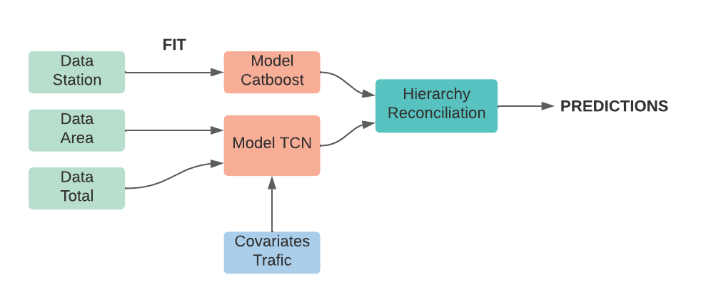

# Smarter-mobility-challenge

## How it works

## How to reproduce results 
1. Run : git clone https://github.com/RandomUsernameToSave/Smarter-mobility-challenge.git
2. Run : cd Smarter-mobility-challenge
3. Download and install requirements using pip install -r requirements.txt
4. And run : python main.py

